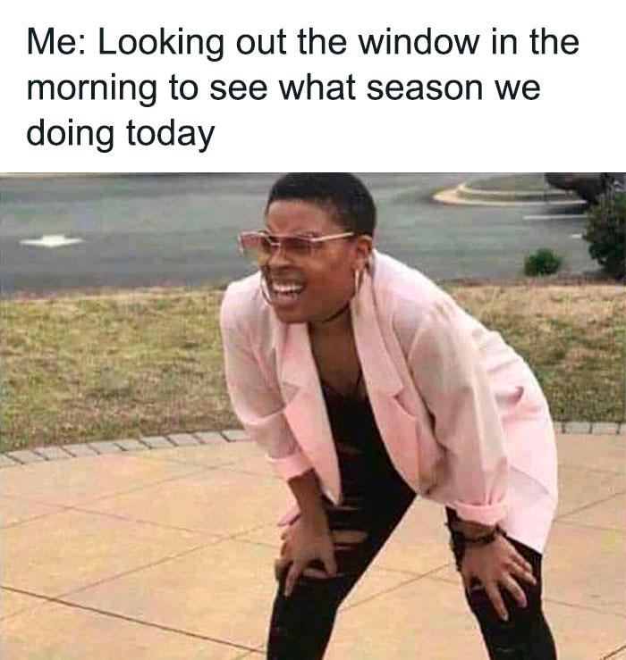

  

<!-- TABLE OF CONTENTS -->

# 📗 Table of Contents

- [📖 About the Project](#about-project)
  - [🛠 Built With](#built-with)
    - [Tech Stack](#tech-stack)
    - [Key Features](#key-features)
- [💻 Getting Started](#getting-started)
  - [Prerequisites](#prerequisites)
- [👥 Authors](#authors)
- [🔭 Future Features](#future-features)
- [🤝 Contributing](#contributing)
- [⭐️ Show your support](#support)
- [🙏 Acknowledgements](#acknowledgements)
- [❓ FAQ (OPTIONAL)](#faq)
- [📝 License](#license)

<!-- PROJECT DESCRIPTION -->

# 📖 WeatherApp 

**WeatherApp** is a full-stack web application that allows users to search for a city's weather, view current weather conditions, and manage stored weather records using CRUD operations (Create, Read, Update, Delete). It utilizes the OpenWeather API for weather data and features both front-end and back-end integration for a seamless user experience.

## 🛠 Built With 

### Tech Stack 

  
Client

  <ul>
    <li><a href="https://reactjs.org/">React.js</a></li>
    <li><a href="https://vitejs.dev/">Vite</a></li>
  </ul>

  
Server

  <ul>
    <li><a href="https://expressjs.com/">Express.js</a></li>
    <li><a href="https://nodejs.org/">Node.js 20+</a></li>
  </ul>

  
Database

  <ul>
    <li><a href="https://www.mongodb.com/">MongoDB</a></li>
  </ul>

<!-- Features -->

### Key Features 

- **Search for a city's weather using Google Places Autocomplete**
- **View current weather conditions fetched from the OpenWeather API**
- **Manage weather records with full CRUD operations**

(<a href="#readme-top">back to top</a>)

## 💻 Getting Started 

To get a local copy up and running, follow these steps.

### Prerequisites

In order to run this project, you need:

- Node.js (v20+)
- MongoDB
- A web browser
- An API key from OpenWeather and Google Maps Places API

(<a href="#readme-top">back to top</a>)
 <!-- AUTHORS -->

## 👥 Authors 

👤 **Ebrahim Al-Yousefi**

- GitHub: [@Cluab](https://github.com/Cluab)
- LinkedIn: [Ebrahim Al-Yousefi](https://www.linkedin.com/in/ebrahim-al-yousefi-207808237/)

(<a href="#readme-top">back to top</a>)
 <!-- FUTURE FEATURES -->

## 🔭 Future Features 

- [ ] **Add unit and integration tests**
- [ ] **Add user authentication for personalized weather tracking**
- [ ] **Implement real-time weather alerts**

(<a href="#readme-top">back to top</a>)
 <!-- CONTRIBUTING -->

## 🤝 Contributing 

Contributions, issues, and feature requests are welcome!

Feel free to check the [issues page](https://github.com/Cluab/weather-app-pma/issues).

(<a href="#readme-top">back to top</a>)
 <!-- SUPPORT -->

## ⭐️ Show your support 

If you like this project, please give it a ⭐️ and consider sharing it with others who might find it helpful!

(<a href="#readme-top">back to top</a>)
 <!-- ACKNOWLEDGEMENTS -->

## 🙏 Acknowledgments 

I would like to thank my mentors, friends, and the open-source community for their continuous support and resources that made this project possible.

(<a href="#readme-top">back to top</a>)
 <!-- FAQ (optional) -->

## ❓ FAQ (OPTIONAL) 

- **How can I get an API key for OpenWeather?**
  - Visit [OpenWeather](https://openweathermap.org/) to create an account and generate an API key.
- **Why is the weather data not showing up?**
  - Make sure you have entered the correct API keys and that your backend server is running.

(<a href="#readme-top">back to top</a>)
 <!-- LICENSE -->

## 📝 License 

This project is [MIT](./LICENSE) licensed.

(<a href="#readme-top">back to top</a>)

